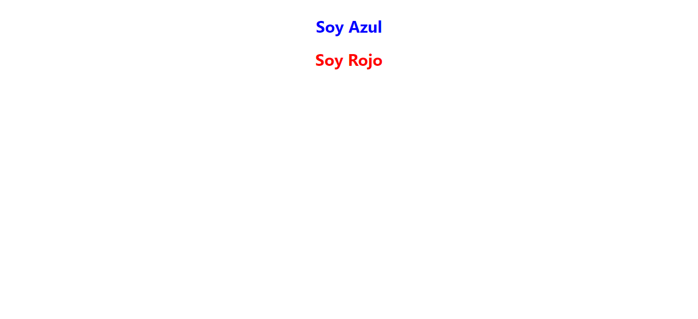
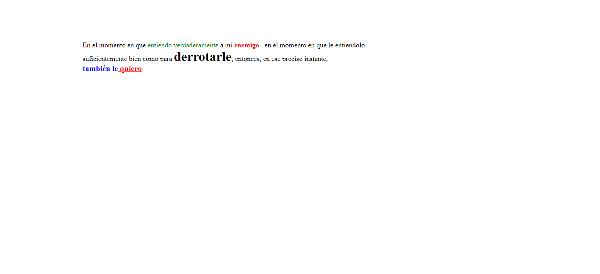

<h1>Taller 9 Heiler_Antonio_Ruiz_Rivas</h1>

<h2> Información</h2>

Curso: full Stack Basico - Grupo 1

Profesor: Cristian Patiño

<h2> Link página web</h2>

<a href="https://hruiz901.github.io/taller-9-full-stack/" target="_blank">Link página web</a>

<h2> Punto 1: Link figma</h2>

<a href="https://www.figma.com/file/zffcJ2desH488Oqda1AGqz/Heiler-Antonio-Ruiz-Rivas--Figma-Excercise?type=design&node-id=103%3A250&mode=design&t=WoaGilUi9emKWL7i-1" target="_blank">Link de Figma</a>

<h2> Punto 2: HTML</h2>

<h2> Punto 3: CSS</h2>

<h2> Punto 4</h2>

<h2> Punto 5</h2>
